# 2020_OO_09

### PPT
https://drive.google.com/file/d/1YAbyKiGB10FCAJPCC27qRK-mU7gXyJ5U/view?usp=sharing

### 姓名：林子軒
### 組員：林子軒
### 學號：C107118123 
### 題目：進出管理系統
#### 內容：因武漢肺炎疫情關係做出一個管理系統，方便做進出管理
#### 功能性需求：紀錄進出、新增個人資料、查詢進出紀錄
    
#### 非功能性需求：使用者介面清楚明瞭、系統方便維護、查詢速度要快
### PERT

### Gantt

### 功能分解圖

#### 需求分析：
* 使用者紀錄進出
* 使用者可以查詢進出紀錄
* 使用者可以刪除資料
* 使用者可以新增資料
* 必須有權限才能使用
#### 使用案例說明
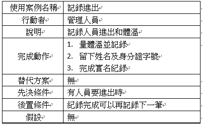

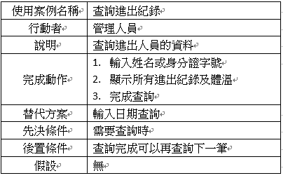

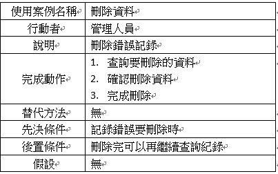

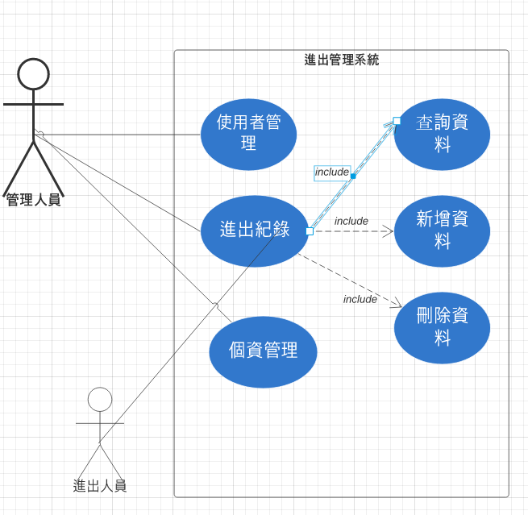
#### DFD圖
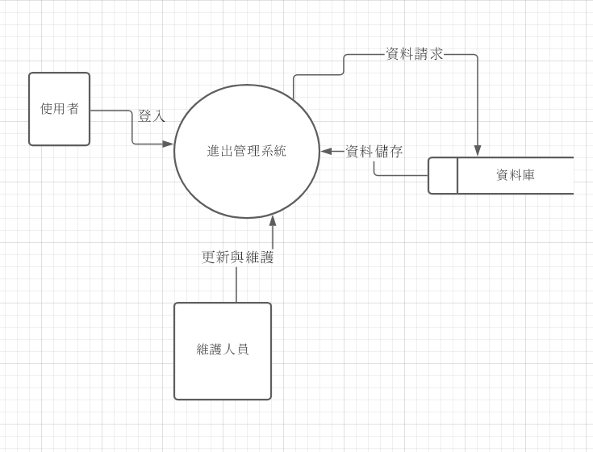

#### 圖0
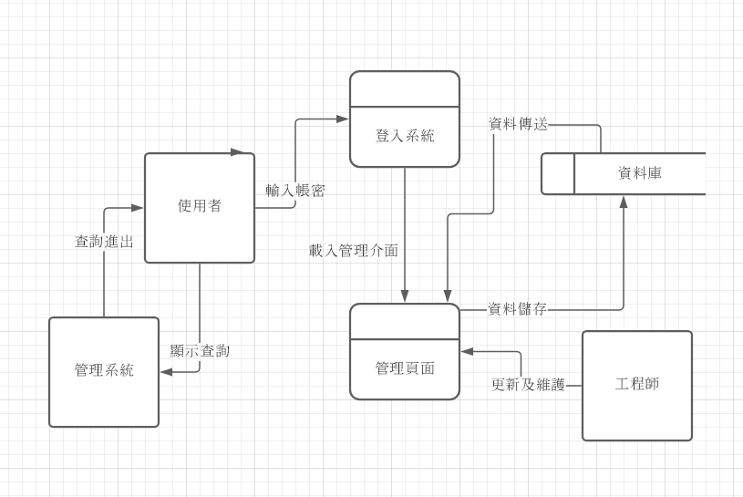

#### UML
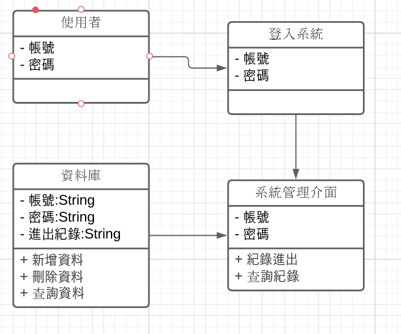

#### 查詢紀錄 活動圖
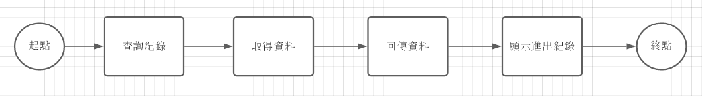

#### 查詢紀錄 循序圖
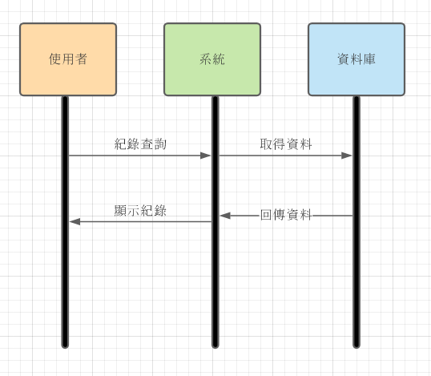

#### 紀錄進出 活動圖
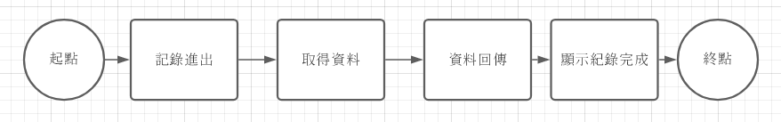

#### 紀錄進出 循序圖
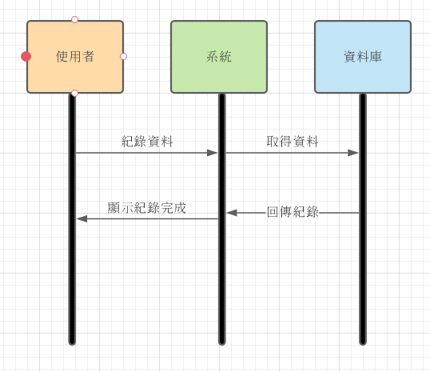

#### 刪除資料 活動圖
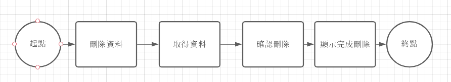

#### 刪除資料 循序圖
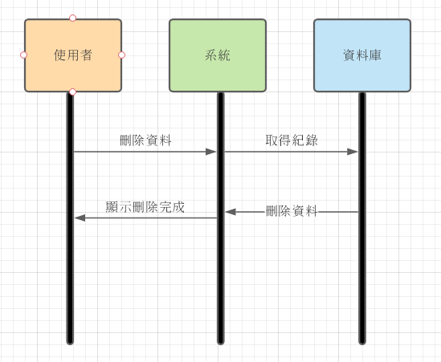

#### 分鏡板
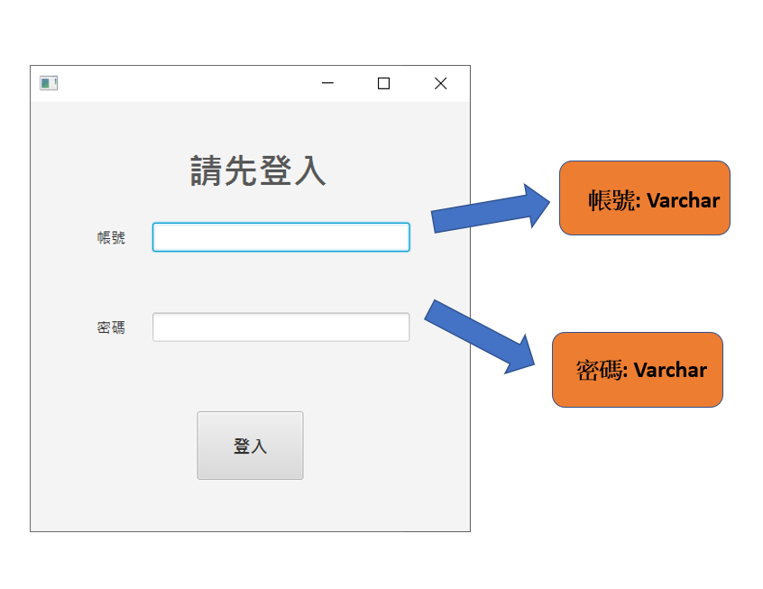

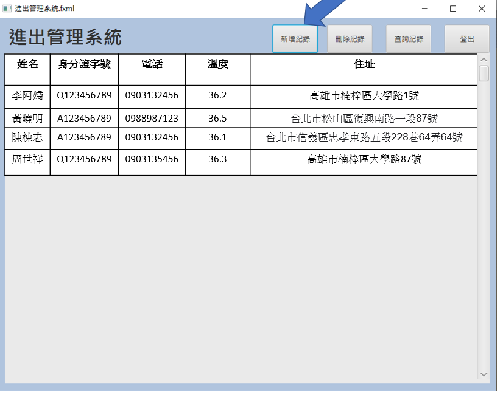

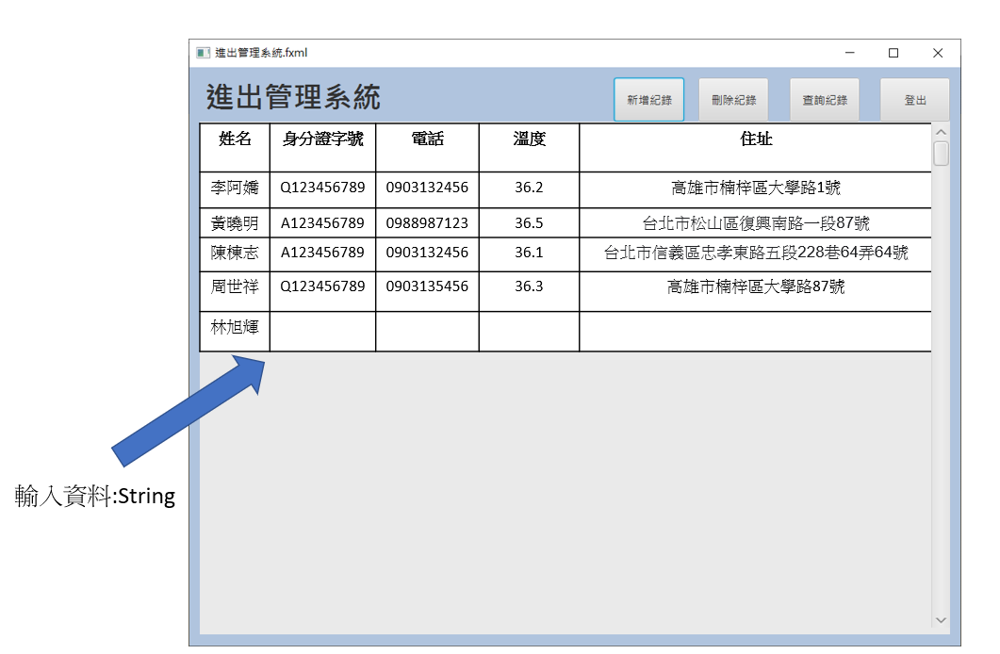

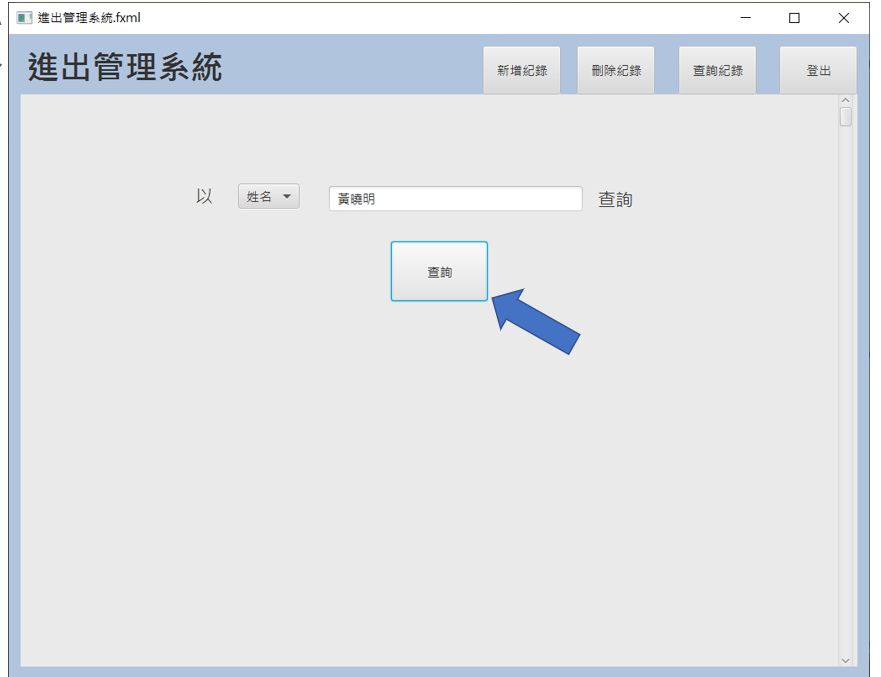

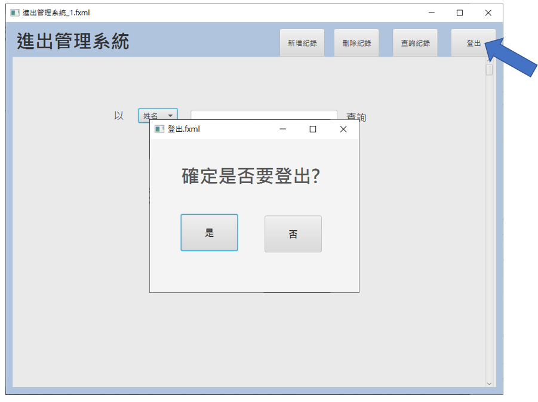
